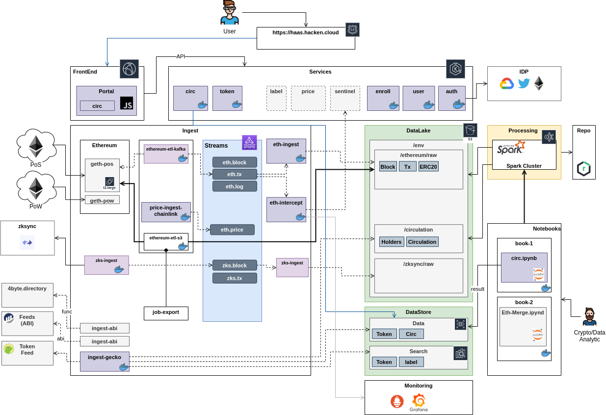

# haas-demo

HaaS Platform Demo 

## Modules

- [haas-core](haas-core)        - Core Entities and Utils
- [haas-token](haas-token)      - Tokens Service (CRUD,Search)
- [haas-ingest](haas-ingest)    - Ingest (blockchains, feeds)
- [haas-lake](haas-lake)        - DataLake
- [haas-circ](haas-circ)        - Circulation Product
- [haas-analytics](haas-analytics)   - Analytics Code snippets for Notebooks

----
## Architecture

