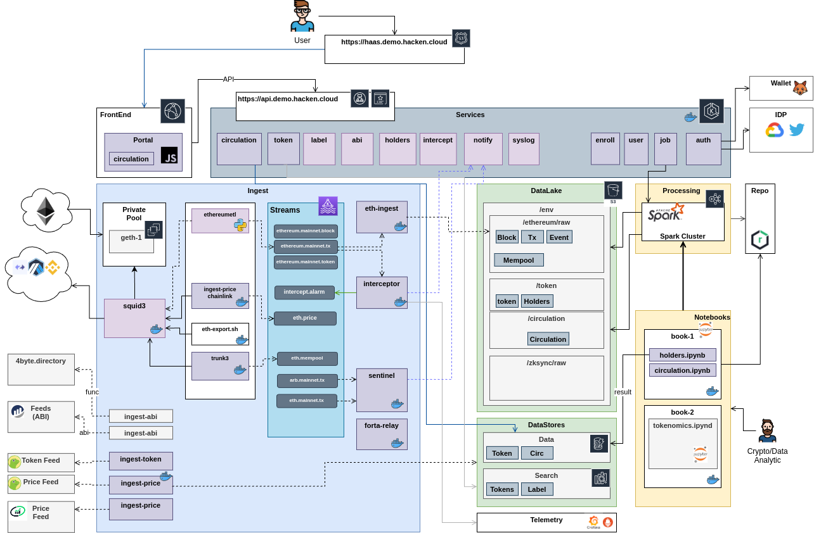

# haas-demo

HaaS Platform Demo 

## Modules

- [demo](demo)                          - Demo Docker infra
- [haas-core](haas-core)                - Core Entities and Utils
- [haas-token](haas-token)              - Tokens Service (CRUD,Search)
- [haas-ingest](haas-ingest)            - Ingester (blockchains, feeds, metadata)
- [haas-intercept](haas-intercept)      - On-chain data real-time Interceptor
- [haas-lake](haas-lake)                - DataLake
- [haas-circ](haas-circ)                - Circulation Supply Product
- [haas-label](https://github.com/syspulse/skel/tree/main/skel-tag)                - Currently __skel-tag__ is used for labels
- [haas-analytics](haas-analytics)      - Analytics Code snippets for Notebooks
- [haas-abi](haas-abi)                  - ABI store
- [haas-supply](haas-supply)            - Mulitchain Circulation Supply
- [haas-holder](haas-holder)            - Holders Service
- [haas-discovery](haas-discovery)      - Datasets discovery service

----
## Demo Architecture

----

(c) Built with __[skel](https://github.com/syspulse/skel)__